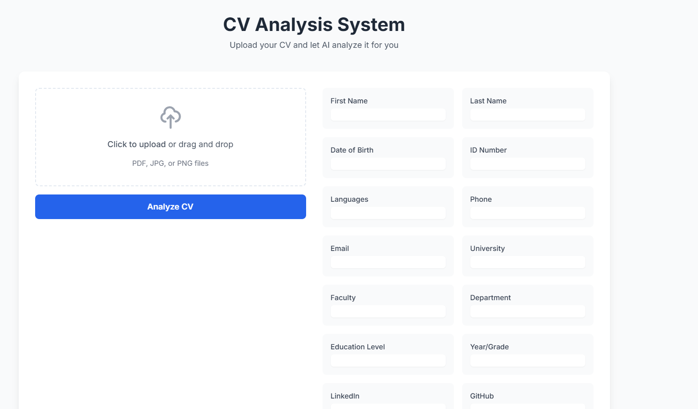
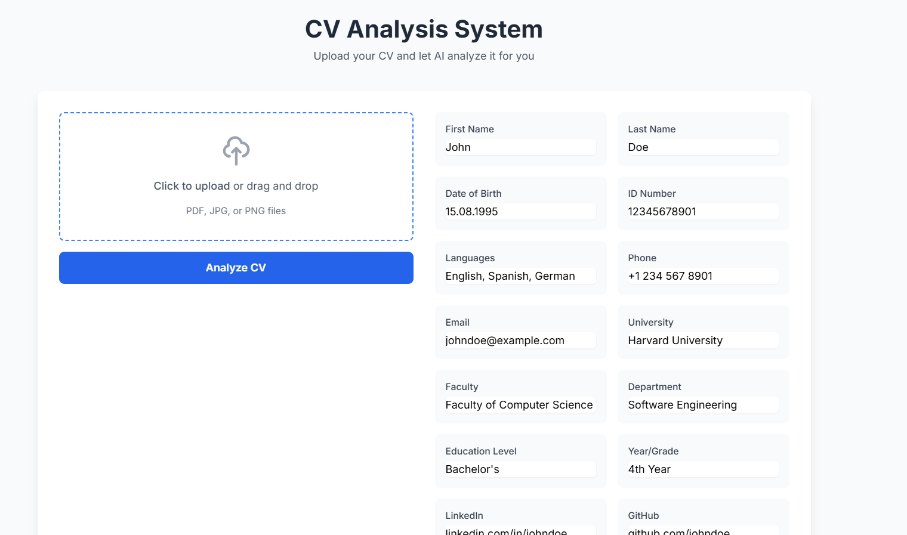

# CVision - AI-Powered Resume Analyzer 🚀



## 🌟 Overview

CVision is a modern web application that uses artificial intelligence to analyze and extract information from resumes/CVs. Powered by Google's Gemini AI, it automatically processes both PDF and image formats to extract key information such as personal details, education, and contact information.

## ✨ Features

- 🤖 AI-powered CV analysis using Google Gemini
- 📄 Support for PDF and image formats (JPG, PNG)
- 🎯 Extracts comprehensive information including:
  - Personal details
  - Contact information
  - Educational background
  - Professional profiles (LinkedIn, GitHub)
- 💫 Modern, responsive UI with drag-and-drop support
- ⚡ Real-time processing and results
- 🔒 Secure file handling

## 🖼️ Screenshots

### Main Interface


### Analysis Results


## 🚀 Getting Started

### Prerequisites

- Python 3.8 or higher
- Google Gemini API key

### Installation

1. Clone the repository
```bash
git clone https://github.com/yourusername/cvision.git
cd cvision
```

2. Create and activate virtual environment
```bash
python -m venv venv
# For Windows
venv\Scripts\activate
# For Unix or MacOS
source venv/bin/activate
```

3. Install dependencies
```bash
pip install -r requirements.txt
```

4. Create `.env` file and add your Google Gemini API key
```env
GOOGLE_API_KEY=your_api_key_here
```

5. Run the application
```bash
python app.py
```

6. Open your browser and navigate to `http://127.0.0.1:5000`

## 🛠️ Technologies Used

- **Backend:**
  - Flask (Python web framework)
  - Google Gemini AI API
  - PyMuPDF (PDF processing)
  - Pillow (Image processing)

- **Frontend:**
  - Tailwind CSS
  - jQuery
  - Modern JavaScript

## 📋 Features in Detail

The application can extract the following information from CVs:
- First Name
- Last Name
- Date of Birth
- ID Number (if available)
- Languages
- Phone Number
- Email Address
- University
- Faculty
- Department
- Education Level
- Year/Grade
- LinkedIn Profile
- GitHub Profile

## 🤝 Contributing

Contributions are welcome! Please feel free to submit a Pull Request.

1. Fork the project
2. Create your feature branch (`git checkout -b feature/AmazingFeature`)
3. Commit your changes (`git commit -m 'Add some AmazingFeature'`)
4. Push to the branch (`git push origin feature/AmazingFeature`)
5. Open a Pull Request

## 📝 License

This project is licensed under the MIT License - see the [LICENSE](LICENSE) file for details.

## 🙏 Acknowledgments

- Google Gemini AI for providing the powerful CV analysis capabilities
- The open-source community for the amazing tools and libraries


---
<p align="center">Made with ❤️ using Google Gemini AI</p> 
